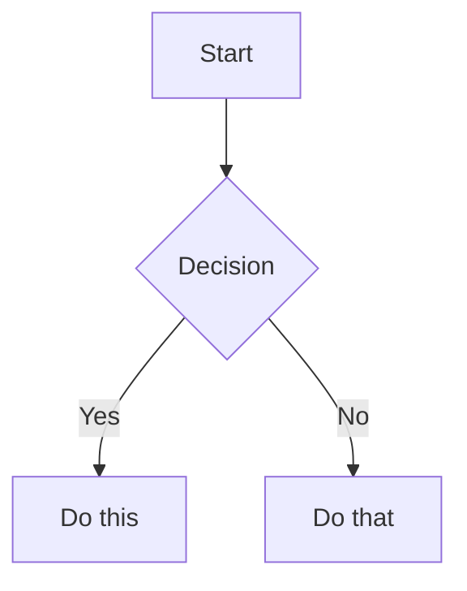

# Obsidian Flavored Markdown Syntax

Reference for Obsidian-specific Markdown extensions beyond CommonMark/GFM. Use this when composing or repairing notes so the vault graph is navigable and renders correctly. Standard Markdown (headings, bold, italic, lists, tables, code fences) is assumed.

Adapted from the Obsidian Flavored Markdown documentation (https://help.obsidian.md/obsidian-flavored-markdown).

## Internal links (WikiLinks)

Prefer WikiLinks for all in-vault links so Obsidian updates them automatically on rename.

```markdown
[[Note Title]]                     Link to a note
[[Note Title|Display Text]]        Link with custom display text
[[Note Title#Heading]]             Link to a heading inside a note
[[Note Title#^block-id]]           Link to a specific block
[[#Heading in same note]]          Link to a heading in the current note
[[#^block-id]]                     Link to a block in the current note
```

Use `[text](url)` Markdown links **only** for external URLs.

## Block references

Block links and embeds turn flat notes into a navigable graph. Define a block ID by appending `^block-id` to a paragraph:

```markdown
This claim can be linked or transcluded directly. ^key-claim
```

For lists, tables, and quotes, place the block ID on its own line after a blank line:

```markdown
> A quoted passage worth citing.

^cite-2024
```

Reference it from anywhere with `[[Note Title#^key-claim]]` or embed it with `![[Note Title#^key-claim]]`. Use block IDs to cite a specific extracted claim from a source note in a permanent note's `Source grounding` section.

## Embeds (transclusion)

Prefix any WikiLink with `!` to embed its content inline:

```markdown
![[Note Title]]                    Embed a whole note
![[Note Title#Heading]]            Embed one section
![[Note Title#^block-id]]          Embed one block
![[image.png]]                     Embed an image
![[image.png|300]]                 Embed image at 300px wide (aspect kept)
![[image.png|640x480]]             Embed image at fixed width x height
![[document.pdf]]                  Embed a PDF
![[document.pdf#page=3]]           Embed a specific PDF page
![[audio.mp3]]                     Embed audio
![[Index.base]]                    Embed a Bases view (see BASES.md)
![[Index.base#View Name]]          Embed a specific Bases view
```

External images: `` or `` for a width.

## Callouts

Use callouts to make structured sections (warnings, source grounding, open questions) visually scannable.

```markdown
> [!note]
> A basic callout.

> [!warning] Custom Title
> A callout with a custom title.

> [!question]- Collapsed by default
> Foldable content (`-` starts collapsed, `+` starts expanded).
```

Nest callouts by adding another `>`:

```markdown
> [!question] Outer
> > [!note] Inner
> > Nested content.
```

Common types (each with aliases): `note`, `abstract`/`summary`/`tldr`, `info`, `todo`, `tip`/`hint`/`important`, `success`/`check`/`done`, `question`/`help`/`faq`, `warning`/`caution`, `failure`/`fail`/`missing`, `danger`/`error`, `bug`, `example`, `quote`/`cite`.

## Tags

```markdown
#tag                  Inline tag
#nested/tag           Hierarchical tag
```

Tags accept letters (any language), numbers (not as the first character), `_`, `-`, and `/` for nesting. In frontmatter, list tags **without** the `#` prefix (see NOTE-FORMAT.md). Prefer links over tag proliferation; use tags for broad retrieval facets only.

## Highlights and comments

```markdown
==Highlighted text==                  Highlight

Visible %%hidden inline%% text.       Inline comment (not rendered)

%%
Entire block hidden in reading view.
%%
```

## Footnotes

```markdown
Text with a footnote[^1].

[^1]: Footnote content.

Inline footnote.^[Defined right here.]
```

## Math (LaTeX)

```markdown
Inline: $e^{i\pi} + 1 = 0$

Block:
$$
\frac{a}{b} = c
$$
```

## Diagrams (Mermaid)

````markdown

````

To make a Mermaid node link to a vault note, add `class NodeName internal-link;`. For larger visual artifacts (mind maps, architecture graphs), prefer a `.canvas` file — see CANVAS.md.

## Composition checklist

- Link the first meaningful mention of a related concept with `[[ ]]`.
- Add a `^block-id` to any claim a permanent note will cite, then reference it from `Source grounding`.
- Use callouts for `Source grounding` and `Open questions` blocks where they aid scanning.
- Keep frontmatter tags un-prefixed; use inline `#tags` sparingly in body text.
